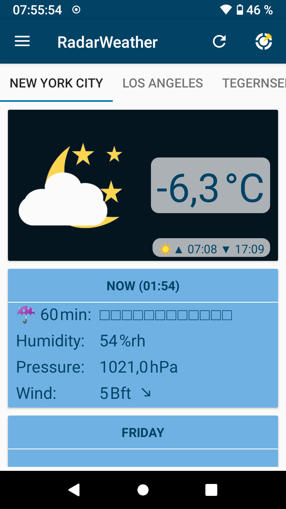
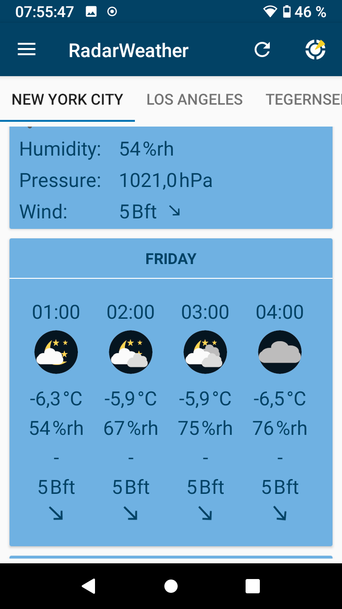
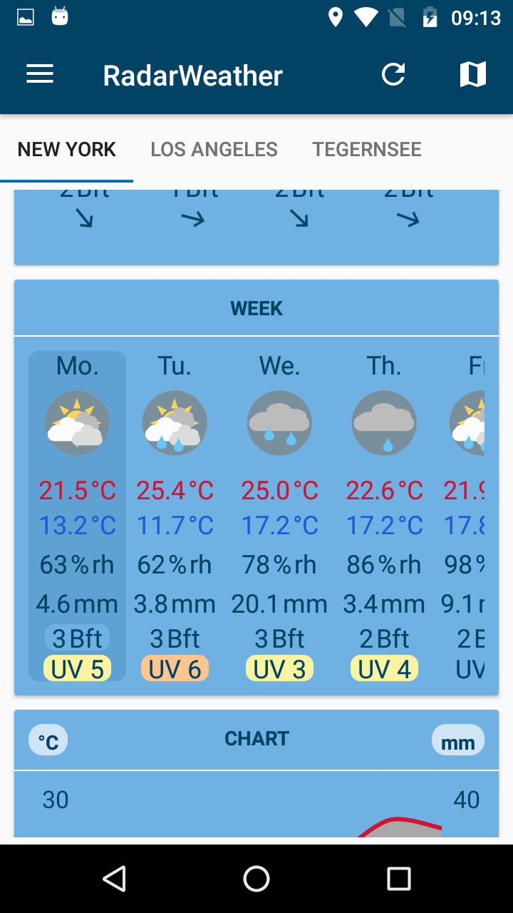
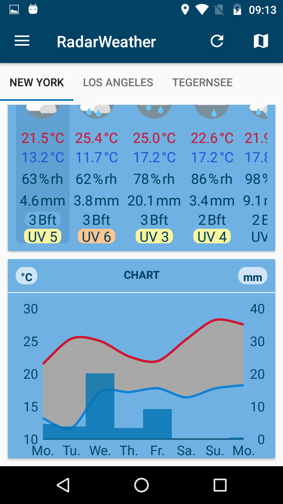
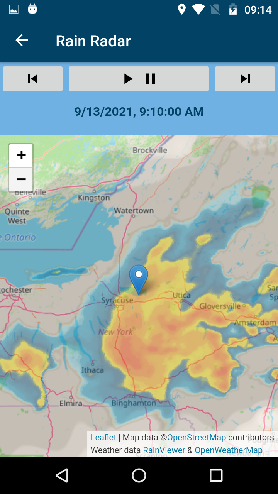
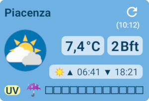

# RadarWeather

    

This application is forked from Privacy Friendly Weather (https://github.com/SecUSo/privacy-friendly-weather) a privacy friendly weather app.
The original function has been modified to support the new OpenWeather One Call API, which provides a lot more features, like precipitation forecast for the next 60 minutes,
hourly forecasts for the next 2 days, 8 day week forecasts, etc. In addition a rain radar functionality powered by RainViewer API (https://www.rainviewer.com/api.html) has been added. More weather categories were added, most images and icons were replaced. RadiusSearch now also shows the results on a map with weather icons.
A chart showing forecasts with min/max temperature and precipitation for the next week has been added. In addition to the built in city list it is now also possible to use search-as-you-type location search via the photon API (https://photon.komoot.io) which is based on OpenStreetMap.

There are also two new widgets:

If permission for GPS is given the widget will automatically update position on a regular base.

As One Call API only allows 1000 calls per day an own OpenWeatherMap API key is mandatory.

For subscriptions later than Aug 15, 2022 you need a free subscription and OneCallAPI 3.0 with a limit of 1000 (free) calls per day.

Please register for free account at: https://home.openweathermap.org/users/sign_up

## License

This app - like the original app Privacy Friendly Weather - is licensed under the GPLv3.

The app also uses:
- The weather data service is provided by [OpenWeatherMap](https://openweathermap.org/), under <a href='http://creativecommons.org/licenses/by-sa/4.0/'>Creative Commons licence CC BY-SA 4.0</a>
- Icons from [Google Material Design Icons](https://material.io/resources/icons/) licensed under <a href='http://www.apache.org/licenses/LICENSE-2.0'>Apache License Version 2.0</a>
- Material Components for Android (https://github.com/material-components/material-components-android) which is licensed under <a href='https://github.com/material-components/material-components-android/blob/master/LICENSE'>Apache License Version 2.0</a>
- Leaflet which is licensed under the very permissive <a href='https://github.com/Leaflet/Leaflet/blob/master/FAQ.md'>2-clause BSD License</a>
- Leaflet.TileLayer.ColorFilter which is licensed under <a href='https://github.com/xtk93x/Leaflet.TileLayer.ColorFilter/blob/master/LICENSE'>MIT License</a>
- RainViewer API which is free (https://www.rainviewer.com/api.html) & RainViewer API Example (https://github.com/rainviewer/rainviewer-api-example)
- WilliamChart (com.db.chart) (https://github.com/diogobernardino/williamchart) which is licensed under <a href='http://www.apache.org/licenses/LICENSE-2.0'>Apache License Version 2.0</a>
- Android SQLiteAssetHelper (com.readystatesoftware.sqliteasset) (https://github.com/jgilfelt/android-sqlite-asset-helper) which is licensed under <a href='https://github.com/jgilfelt/android-sqlite-asset-helper/blob/master/LICENSE'>Apache License Version 2.0</a>
- Android Volley (com.android.volley) (https://github.com/google/volley) which is licensed under <a href='https://github.com/google/volley/blob/master/LICENSE'>Apache License Version 2.0</a>
- AndroidX libraries (https://github.com/androidx/androidx) which is licensed under <a href='https://github.com/androidx/androidx/blob/androidx-main/LICENSE.txt'>Apache License Version 2.0</a>
- AutoSuggestTextViewAPICall (https://github.com/Truiton/AutoSuggestTextViewAPICall) which is licensed under <a href='https://github.com/Truiton/AutoSuggestTextViewAPICall/blob/master/LICENSE'>Apache License Version 2.0</a>
- Map data from OpenStreetMap, licensed under the Open Data Commons Open Database License (ODbL) by the OpenStreetMap Foundation (OSMF) (https://www.openstreetmap.org/copyright)
- Search-as-you-type location search is provided by [photon API](https://photon.komoot.io), based on OpenStreetMap. See also (https://github.com/komoot/photon)

## Contributing

If you find a bug, please open an issue in the Github repository, assuming one does not already exist.
  - Clearly describe the issue including steps to reproduce when it is a bug. In some cases screenshots can be supportive.
  - Make sure you mention the Android version and the device you have used when you encountered the issue.
  - Make your description as precise as possible.

If you know the solution to a bug please report it in the corresponding issue and if possible modify the code and create a pull request.

## Try my other apps

| RadarWeather | Gas Prices | Smart Eggtimer | Level | hEARtest | GPS Cockpit | Audio Analyzer |
|:---:|:---:|:---:|:---:|:---:|:---:|:---:|
| |  |  |  |  |  |  |
